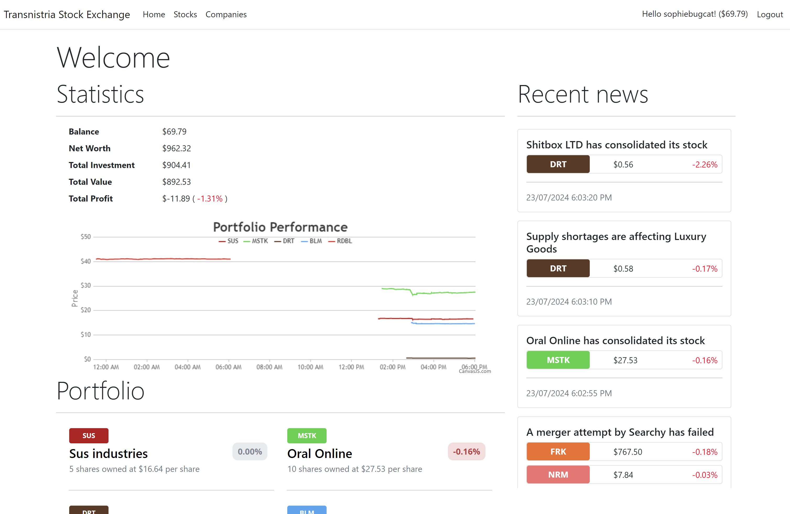
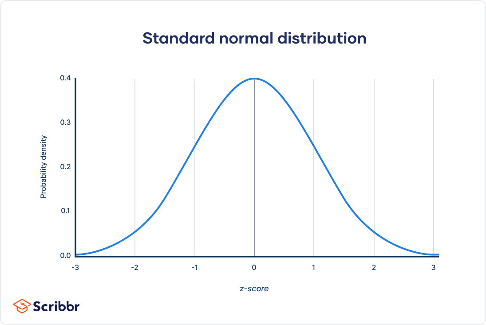
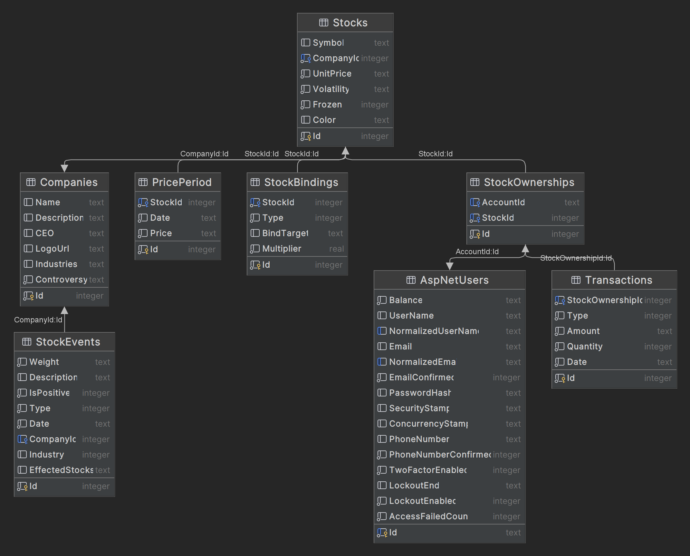

# Gambling my beloved / Transnistrian Stock Exchange
## Overview
This is a stock simulator game, you can purchase and sell stocks, and see how much money you can make. Inspiration and help for this project came from [devChanChan/Calf_Cub](https://github.com/devChanChan/Calf_Cub).

## Development process
### Technologies
- C# .NET Core
- Entity Framework Core (With SQLite)
- ASP.NET Core MVC

### Motivation
I started this project as a fun way to learn ASP.Net and EF Core. Feel free to clone this project and play around with it.

### How it works
This project relies on a [gaussian/normal distribution](https://en.wikipedia.org/wiki/Normal_distribution) to simulate the stock prices more realistically than an equal probability distribution.

Events randomly occur, that can either effect a specific company, or an entire industry. Each stock owned by this company will be effected by a random weight factor controlled by the gaussian distribution.
Stocks and companies also have a volatility and controversy factor, the first of which, controlling the average price change of the stock, and the second, the probability of a big spike or drop in price.

**Database structure**
